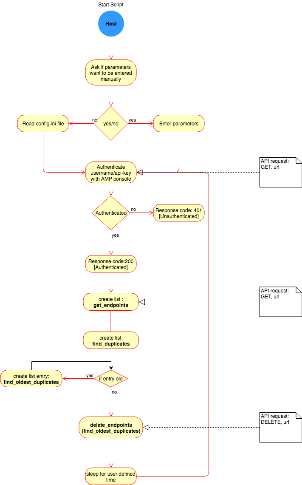

[](https://developer.cisco.com/codeexchange/github/repo/victoriancode/amp4endpoint)
# AMP for Endpoints - Duplicate Fixer
This python script is intended to delete duplicated AMP for Endpoint (AMP4EP) hostnames.

The script executes as follows: 

- Enter AMP4EP API Credentials
- Search all hostnames
- Create hostname duplicate list
- Query duplicate install date 
- Delete dated hostname. 

After the script runs, check AMP4EP Console > Accounts > Audit Log, for changes the script performed.

Use Case: Host machine is wiped, new machine installs new AMP4EP connector. AMP4EP Console displays 2 licenses, one for wiped machine as well as new machine. Script deletes older machine plus GUID with matching hostnames.

[For License Information click here.](./LICENSE)

Authors: Max Wijnbladh and Chris Maxwell

## Installation Guide
Requirements: 

- AMP Console Dashboard login details 
- Python v2.7
- AMP for Endpoints [API documentation v1](https://api-docs.amp.cisco.com/api_resources?api_host=api.eu.amp.cisco.com&api_version=v1)
 
**Step 1:**
Open a terminal and run the following:
```
git clone https://github.com/victoriancode/amp4endpoint
cd victoriancode/amp4endpoint
```
 
**Step 2:**
 
Option 1: If you have parameters, open config.ini, enter credentials and then save file. Then run these commands
```
python amp4ep_duplicate_fixer.py
n
```
 
OR
 
Option 2: Run the following command and your AMP console credentials:
 
Enter your AMP Console details after these commands
```
python amp4ep_duplicate_fixer.py
y
```
_____
## Demo
Video: https://youtu.be/jXujBqelfLU

## UML for script


